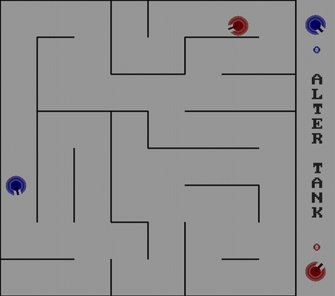

# AlterTank

A local two-player, top-down tank battle game written in C with SDL2. Built as the term project for **Basic Programming**, Computer Engineering program at Sharif University of Technology (Winter 2018).



## Gameplay

Two tanks share a walled arena and fight to be the first to reach a target number of kills. Everything on screen — tanks, bullets, walls, the pop-up icon — is drawn procedurally with SDL2_gfx primitives (circles, lines, boxes); there are no sprite assets.

- **Bullets** ricochet off walls and despawn after a few seconds; each tank can have up to 5 in flight at once.
- **Power-up**: an icon spawns periodically in the arena. Picking it up grants a one-shot piercing laser (active for 5 seconds) that instantly destroys whichever tank it touches.
- **Respawn**: when a tank is destroyed, both tanks respawn at new random (wall-free) positions after a short delay, and the surviving tank's score increments.
- **Match end**: the first tank to reach the target score wins; a summary screen shows total match time.
- **Save/Load**: press `Esc` mid-game to pause, save the current match to disk, or exit; a saved match can be resumed from the start menu.
- **Maps**: choose between a small "Simple" arena and a larger, maze-like "Pro" arena from the map-select screen.

## Controls

| Action | Player 1 (blue) | Player 2 (red) |
|---|---|---|
| Move forward / back | `I` / `K` | `W` / `S` |
| Turn left / right | `J` / `L` | `A` / `D` |
| Fire | `P` | `R` |
| Pause menu | `Esc` | `Esc` |

Menus are navigated with `↑`/`↓` to switch options, `←`/`→` to switch maps or adjust the target score, and `Enter` to confirm.

## Building & running

The game depends on **SDL2**, **SDL2_gfx**, and **SDL2_mixer**, and `CMakeLists.txt` points the compiler at `/usr/include/SDL2`, so it builds cleanly on Linux (including WSL) without any changes:

```bash
sudo apt-get install build-essential cmake libsdl2-dev libsdl2-gfx-dev libsdl2-mixer-dev

mkdir build && cd build
cmake .. -DCMAKE_POLICY_VERSION_MINIMUM=3.5   # only needed with CMake >= 4.0
make

# the game reads pro.txt/simple.txt from its working directory
cp ../pro.txt ../simple.txt .
./AlterTank
```

On Windows, WSL2 (with WSLg for the display) is the easiest way to run it as-is; a native Windows build would need `CMakeLists.txt` retargeted at a Windows SDL2 dev kit (e.g. via MSYS2 or vcpkg), which this archive intentionally leaves untouched.

## Project layout

```
CMakeLists.txt      # builds src/*.c into the AlterTank executable
pro.txt              # "Pro" map layout (wall segments, read at runtime)
simple.txt           # "Simple" map layout (wall segments, read at runtime)
src/
  main.c             # game loop / state machine (menus <-> gameplay)
  Structs.h          # shared data types (Tank, Bullet, Wall, Menu, ...)
  Graph.h             # all SDL2_gfx drawing code
  Logic.h             # map loading, collision, scoring, save/load
  Move.h              # per-frame input handling for both tanks
  HandleEvent.h        # menu input/state transitions
  SelectKeyboard.h      # unused leftover from an earlier control-remap idea
  MMM.mp3, Shot.wav      # audio assets bundled but never wired up (SDL2_mixer
                          # is linked, but no Mix_* call exists in the source)
```

Map files are simple text: a wall count `n` followed by `n` lines of `x1 y1 x2 y2` grid coordinates, scaled up to pixels at load time.

## Archive notes

This is an archived undergraduate project, kept as-is for posterity. The source is unmodified from the original coursework; only the `.gitignore`, this README, and the location of the two runtime map files (moved from the old CLion build directory to the repo root) were added when archiving.
